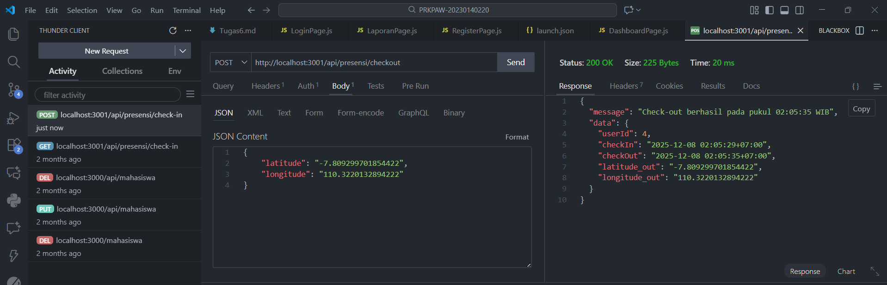
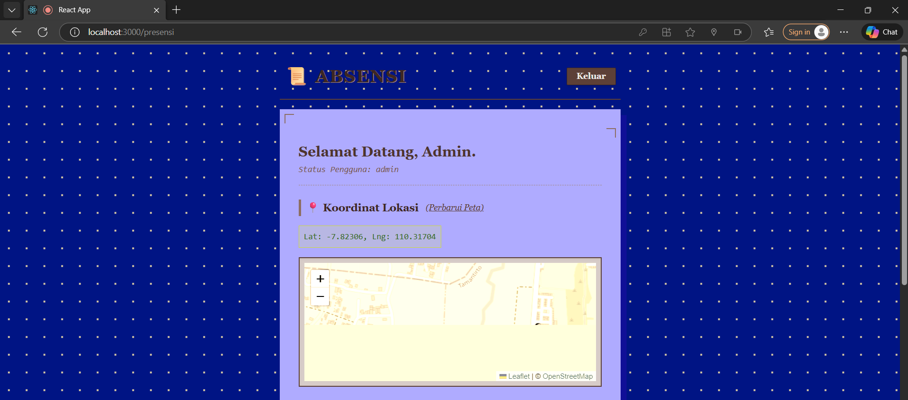

# Endpoint presensi/check-in dengan menggunakan bearer token dan body latitude, longitude

# Tampilan halaman presensi dengan menampilkan maps OSM (Check in Berhasil, Check out Berhasil)

# Tampilan halaman report yg berisi data presensi dari semua user

# Screenshot tabel presensi di database
